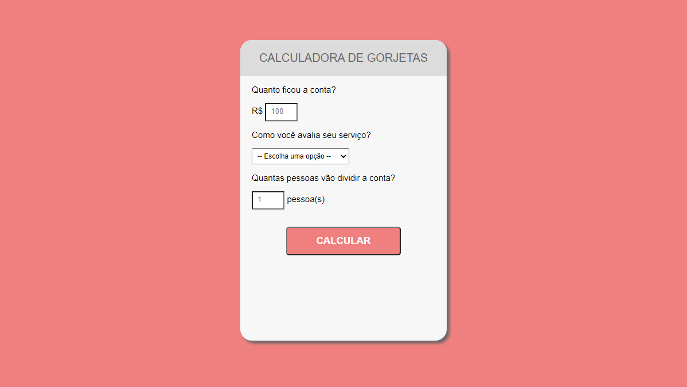

<h1 align="center">Calculadora de Gorjetas</h1>

<h1>
  </img>
</h1>

## 🔖 Sobre
O projeto é uma aplicação web simples para cálculo de garjota baseado na quantidade de pessas que irão divir a conta.

## 🛠 Tecnologias utilizadas
O projeto foi desenvolvido usando as seguintes tecnologias:

- HTML
- CSS
- Javascript

## 📦 Como baixar o projeto
```bash

  # Clonar repositório
  $ git clone https://github.com/samuelfcf/Calculadora-de-gorjetas-

  # Entrar no diretório
  $ cd calculatetips

  # executar o arquivo index.html

```
---
Desenvolvido por Samuel Felipe Castro Fernandes